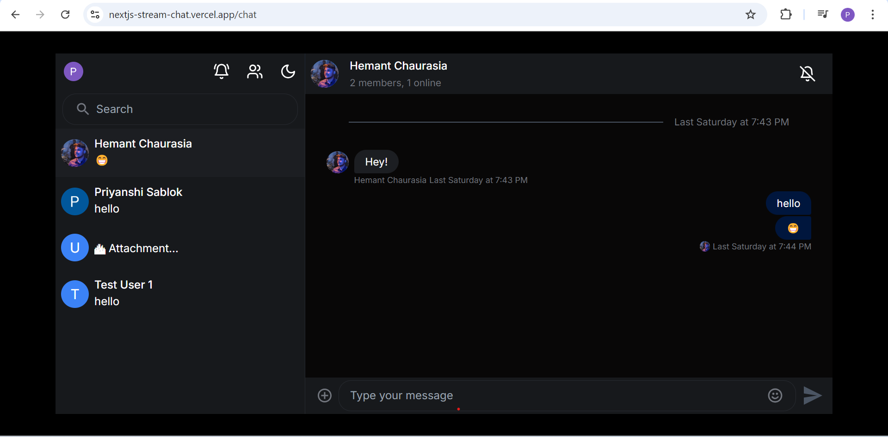
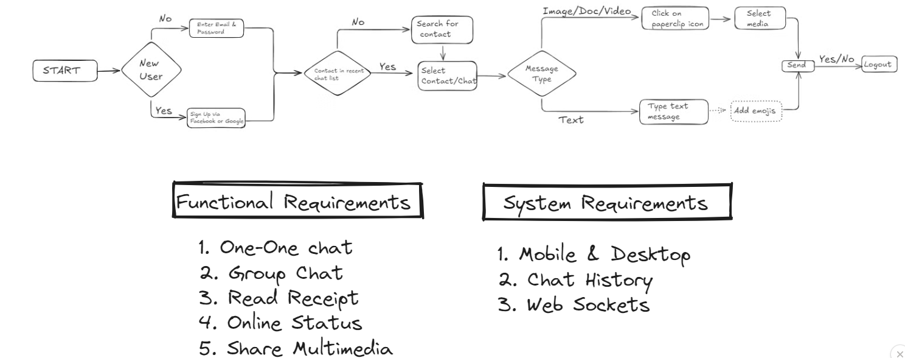
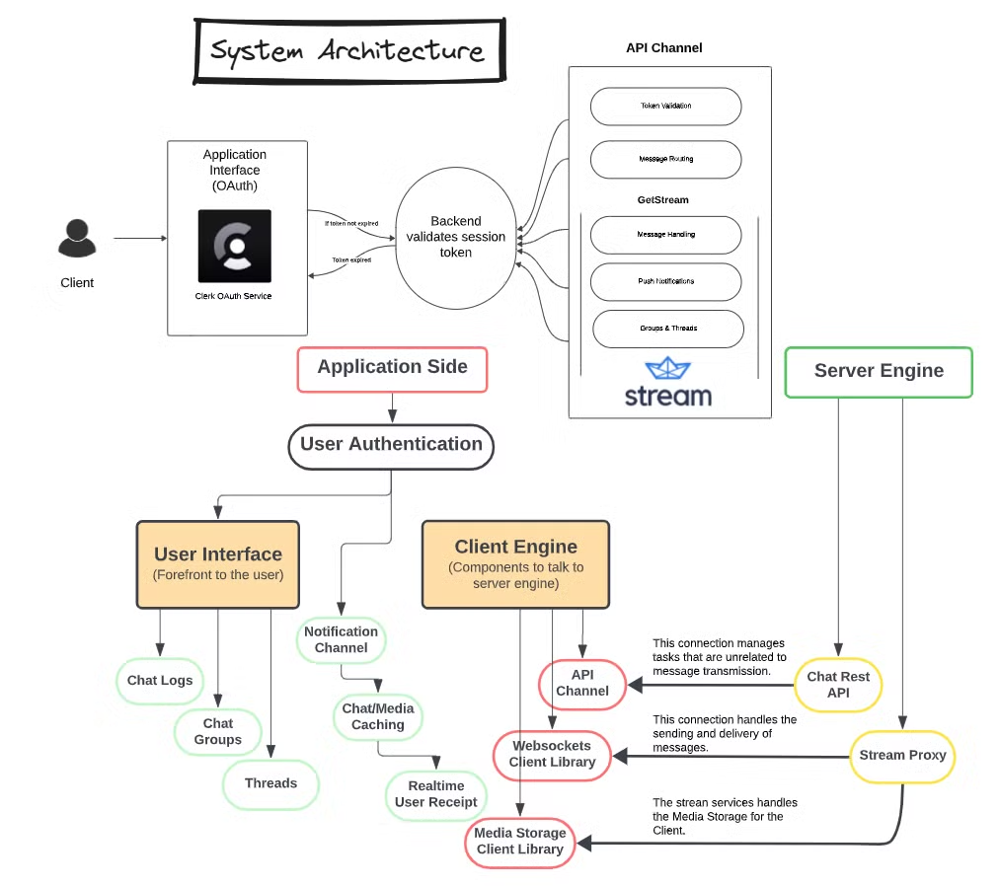

# Flow ChatApp 



Flow Chat is a full-stack chat application based on Next.js featuring real-time messaging and responsive design. It requires a low latency architecture so that the recipients may get the messages from the sender, instantly.

## Documentation

https://functional-value-95a.notion.site/DOCUMENTATION-102b31e92a79808a830bc39636d95024
## Demo Video 
https://drive.google.com/file/d/1-N0vOtsyFSjCPOTbB7G3FJ-MltJJeI5-/view?usp=sharing

## Features

1. **Real-Time Messaging**  
   - Users can send and receive messages instantly within a chat room.
     
2. **Push Notifications**  
   - Notifications are delivered based on active sessions, ensuring users only receive notifications on active devices.

3. **Light and Dark Mode**  
   - Users can switch between light and dark themes to suit their visual preferences.
     
4. **Single & Group Chat feature** 
   - It allows you to interact with single and multiple users in real-time.
     
5. **User Authentication with Clerk**  
   - Secure authentication for users is managed through **Clerk**, allowing for easy login with email, Google, or other supported providers.

6. **Message Read Receipts**  
   - Users can see when their messages have been read by the recipient, improving communication transparency.

7. **Reactions**  
   - Quick emoji-based reactions (like thumbs up or heart) enable lightweight interaction with messages.
     
8. **Threaded Replies**  
   - Users can reply directly to specific messages within threads, creating structured sub-conversations. This is ideal for group chats where multiple discussions happen simultaneously.
     
9. **Media Sharing**  
    - Users can upload and share images, videos, or files directly within the chat, supporting more dynamic and interactive conversations.
      
10. **Chatbot**  
   - Chatbot to communicate with users via a chat interface.         


## How to Get Started

1. **Clone the Repository.**
   
2. **Install Dependencies:**
   ```bash
   npm install
   ```
## Configuration

1. **Set Up Environment Variables:**
    - Create a `.env.local` file in the project root.
      
    - Add your Clerk API keys:
    ```bash
    CLERK_PUBLISHABLE_KEY=<your-publishable-key>
    CLERK_SECRET_KEY=<your-secret-key>
    ```
    - Add your Stream Chat project credentials:
      
    ```bash
    STREAM_API_KEY=<your-stream-api-key>
    STREAM_APP_ID=<your-stream-app-id>
    STREAM_TOKEN_SECRET=<your-stream-token-secret>
    ```

##  Running the Project

1. **Start the Development Server:**

    In the terminal, run:
    ```bash
    npm run dev
    ```

2. **Access the Application:** 

    Open your browser and navigate to:
    ```bash
    http://localhost:3000
    ```

    Your development environment should now be up and running!

## ChatBot

Install Python : https://www.python.org/downloads/

Install pip

```
curl https://bootstrap.pypa.io/get-pip.py -o get-pip.py
```

```
python3 get-pip.py
```

Ensure pip is installed by running the following command

```
pip --version
```

If you have Python & pip installed then check their version in the terminal or command line tools

```
python3 --version
```

```
pip --version
```

## Installing Flask

In your terminal run the requirements.txt file using this pip

```
pip install -r requirements.txt
```

## Running ChatBot Application in Terminal

```
cd into your directory
```

```
python3 app.py
```


##  Tech Stack I Used & Why?

### **Frontend:**
- **Next.js:** Provides a framework for server-rendered React applications, enhancing performance and SEO, with built-in routing and API routes.
- **React:** A popular JavaScript library for building dynamic and interactive user interfaces with a component-based architecture.
- **Tailwind CSS:** Speeds up styling with pre-defined CSS classes, eliminating the need for writing custom CSS.
- **TypeScript:** Improves code readability and reliability by catching errors during development, making the codebase maintainable.

### **Backend:**
- **Next.js API Routes:** Allows easy creation of server-side endpoints, improving performance and security by handling logic on the server.
- **Getstream SDK:** Provides a full-featured solution for building chat applications, saving time on implementing complex chat features.
- **Clerk:** Simplifies user authentication, reducing development time and ensuring secure sign-in functionality.

### **Chatbot:**
- **DialoGPT-medium:** A pre-trained language model used for generating human-like responses, making interactions more natural and engaging.

## User Flow



## Solution Architecture



## Deployment on Vercel

### 1. Configure Environment Variables

Before deploying, make sure you set the required environment variables:

1. Go to your Vercel project dashboard.
2. Navigate to the **"Settings"** tab and click on **"Environment Variables"**.
3. Add the following variables:
   
    ```bash
    CLERK_PUBLISHABLE_KEY=<your-clerk-publishable-key>
    CLERK_SECRET_KEY=<your-clerk-secret-key>
    STREAM_API_KEY=<your-stream-api-key>
    STREAM_APP_ID=<your-stream-app-id>
    STREAM_TOKEN_SECRET=<your-stream-token-secret>
    ```

### 2. Deploy Your Project

1. After selecting your project, Vercel should automatically detect that it's a **Next.js** app.
2. Click on **"Deploy"** and wait for the build process to complete.

Once the deployment is successful, Vercel will provide you with a live URL for your project.

## Author
Name - Priyanshi Sharma , 
Branch - Mechanical Engineering , 
Campus - IIT Patna , 
Role - Software Engineer
